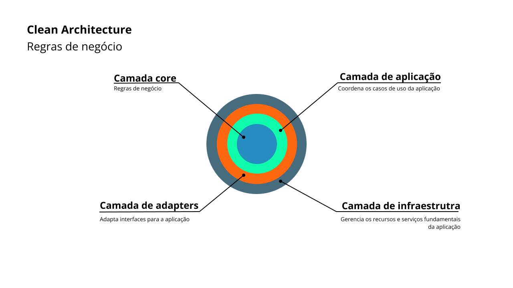

# Email Microservice


This project is for sending emails, built with Java, Java Spring and AWS Simple Email Service.

The aim of the project is to complete a technical test focusing on Uber's back-end, based on [video](https://www.youtube.com/watch?v=eFgeO9M9lLw&t=1160s&ab_channel=FernandaKipper%7CDev&sttick=0)
 by Fernada Kipper.

## ✅ Prerequisites

Before you start, make sure you meet the following requirements:

- Java 17.
- Maven.
- AWS - SES profile account.

## 💻 Installation

1. Clone the repository:

```bash
git clone https://github.com/AnthonyWendy/uber-code-challange-java
```

2. Install dependencies with Maven

3. Update `application.properties` puting your AWS Credentials

```yaml
aws.region=us-east-1
aws.accessKeyId=1111111
aws.secretKey=111111
```

## 🚀 API Endpoints

Send e-mail

```
POST -> http://localhost:8080/api/email/send
```
JSON Body

```
{
  "to": "anthonywendyantunesdelima@gmail.com",
  "subject": "teste",
  "body": "teste"
}
```

## Architeture using



## 🤝 Contributing

Contributions are welcome! If you find any issues or have suggestions for improvements, please open an issue or submit a pull request to the repository.
When contributing to this project, please follow the existing code style, commit conventions, and submit your changes in a separate branch.

## 📚 Study base

- Videos
  - [Video of challange](https://www.youtube.com/watch?v=eFgeO9M9lLw&t=1160s&ab_channel=FernandaKipper%7CDev&sttick=0).
- Books
  - [Article about book clean architeture](https://medium.com/luizalabs/descomplicando-a-clean-architecture-cf4dfc4a1ac6)
